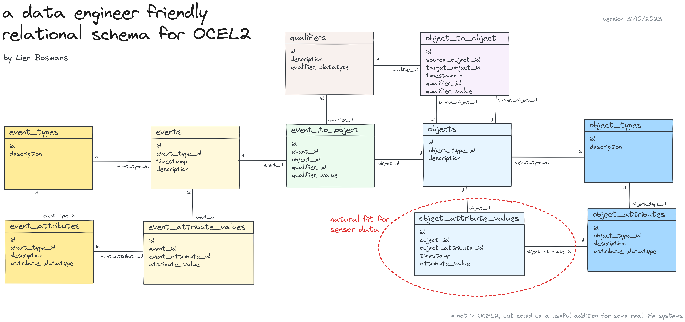

# Stack't

Stack't is a small data stack (duckdb + dbt) in a box (Docker container), that specializes in ingesting object-centric event logs in the OCEL2 format & transforming them into a data structure that is more general and therefore friendlier for data engineers. 

Stack't was inspired by
* 'Modern Data Stack in a Box with DuckDB', blogpost by Jacob Matson. (https://duckdb.org/2022/10/12/modern-data-stack-in-a-box.html)
* van der Aalst, Wil MP. "Object-Centric Process Mining: Unraveling the Fabric of Real Processes." Mathematics 11.12 (2023): 2691. (https://www.mdpi.com/2227-7390/11/12/2691)
* Berti, Alessandro, et al. "OCEL (Object-Centric Event Log) 2.0 Specification." (2023). (https://www.ocel-standard.org/2.0/ocel20_specification.pdf)

## Stack't relation schema



## Quick start

* Save your ocel2 event log in sqlite format inside the folder `event_log_datasets`. You can export an example log from https://ocelot.pm/.
* Update the source and file names at the top of the python script `python_code\generate_dbt_models.py`.
* Run below commands to get started.

    ```
    docker build --progress plain -t stackt .
    docker run --rm -it -v my-path-to\stack-t\:/stackt stackt
    python3 ../python_code/generate_dbt_models.py 
    dbt build
    ```
* Use a database administrator (f.e. DBeaver) to explore the resulting DuckDB database `dev.duckdb`. The overview tables about your event log are located inside the `mart` schema.

## Slower start

You'll need a Docker environment (f.e. Docker desktop) to build and run the Python image that is defined in `Dockerfile`. Once Docker desktop is running, you execute a `docker build` command to build the image. This may take a while the first time.

```
docker build --progress plain -t stackt .
```

When the image is built succesfully, you can run a container of this image using a `docker run` command. You need to replace the 'my-path-to' with the full path of this project on your computer . This mounts the `stack-t` folder on your container and allows you to use the files inside it, make changes to them and create new ones.

```
docker run --rm -it -v my-path-to\stack-t\:/stackt stackt
```

Now you'll see something like `root@b7095ae55002:/stackt/dbt_project# `. This means you are now working inside the container. Navigate to `python_code\generate_dbt_models.py` and change the source name and file name, based on your ocel2 event log.

```
## Change source_name and sqlite_db_name below!

source_name = 'ocel2_source_name'
sqlite_db_name = 'ocel2_source_name.sqlite'
```

This python script is used to automatically generate the dbt models for staging and transformation. Run it inside the container using below command.

```
python3 ../python_code/generate_dbt_models.py 
```

Finally, you can run all dbt models.

```
dbt build
```

If all models run succesfully, you can use a database manager (f.e. DBeaver) to view the tables inside your DuckDB database `dev.duckdb`. The overview tables about your event log are located inside the `mart` schema.

You can use the instructions on the DuckDB website to download and install DBeaver: https://duckdb.org/docs/guides/sql_editors/dbeaver.html.


## About me and this project

I'm Lien Bosmans, a date enthusiast located in Leuven (Belgium). This project is my personal adventure into process mining & building a MDS-in-a-box. Feel free to reach out on lienbosmans@live.com with your feedback and questions.
